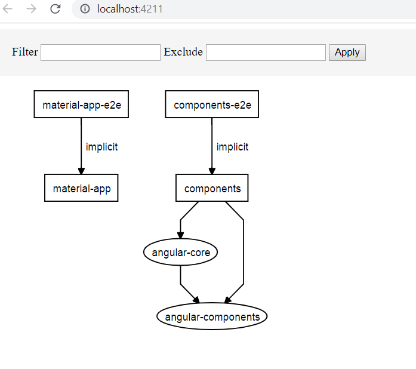
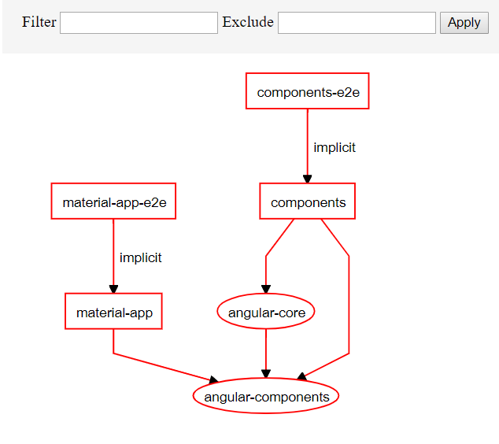

## Description of workspace
This monorepo workspace is consisted by 2 libraries that simulate our existing angular libraries
 - **component-lib**: From Angular components repo
 - **core-lib**:      From crm-frontend-core repo 

#### Applications
The monorepo should have 2 application projects that will make use of the libraries residing in the monorepo.  
 
The material-app project has been created by running `ng g @nrwl/angular:application material-app`

Once the new project is created, it should be independent by any other project as it can be seen by running `npm run nx dep-graph`   
 

This new project can now be ran with `ng serve material-app` from the root of workspace and it should display the welcome page of `nx`.  
 

On the new `material-app` application we can now develop normally as we would with the additional benefit that we can import components from the libraries, e.g. angular-component, angular-core.  

#### Developing on angular-components
A component should be created within the angular-components for this example by the name **ImpExampleComponent**.  
A component can be normally created by running the Angular CLI commands. 
The example component was generated through `ng generate @schematics/angular:component imp-example` and it can be found at /libs/angular-components/src/lib/imp-example.  
 
The library by its own does not have an example project like we had in our single project repositories. We can start developing the component by importing it into the newly created `material-app` application.

Once the component is ready, the project will access it immediately. Then we can run `npm run nx affected:dep-graph` and see what has been affected by the changes inside the library.

 
 
The new graph shows in red anything that will be affected. These changes are compared against the master branch.

WIP 
 
 

